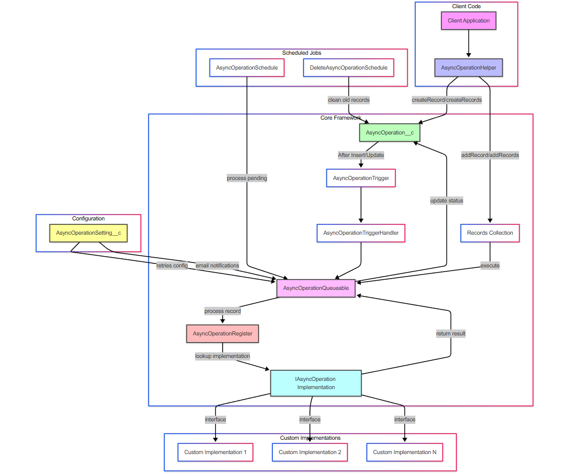

# Architecture Documentation | 架构文档

## Overview | 概述

The Salesforce Async Operation Framework is designed with a layered architecture that separates concerns and provides flexibility for implementation.

Salesforce 异步操作框架采用分层架构设计，实现关注点分离，提供灵活的实现方式。



## Core Components | 核心组件

### 1. IAsyncOperation Interface | IAsyncOperation 接口

The foundation of the framework is the `IAsyncOperation` interface, which defines the contract for all asynchronous operations.

框架的基础是 `IAsyncOperation` 接口，它定义了所有异步操作的合约。

```apex
public interface IAsyncOperation {
    String execute(String JSONString);
}
```

### 2. AsyncOperation__c Custom Object | AsyncOperation__c 自定义对象

This custom object stores the details of each asynchronous operation, including:

此自定义对象存储每个异步操作的详细信息，包括：

- Method name | 方法名称
- JSON payload | JSON 负载
- Status | 状态
- Retry attempts | 重试次数
- Execution logs | 执行日志

### 3. AsyncOperationHelper | 异步操作助手

The helper class provides static methods to create and manage async operations.

助手类提供静态方法来创建和管理异步操作。

Key functions | 主要功能:
- `createRecord()` - Create a single async operation | 创建单个异步操作
- `createRecords()` - Create multiple async operations | 创建多个异步操作
- `asyncCallout()` - Execute an operation immediately | 立即执行操作

### 4. AsyncOperationQueueable | 异步操作队列

This implements the Salesforce `Queueable` interface to process async operations.

实现 Salesforce `Queueable` 接口以处理异步操作。

### 5. AsyncOperationRegister | 异步操作注册器

Manages the registration and lookup of operation implementations.

管理操作实现的注册和查找。

### 6. AsyncOperationSchedule | 异步操作调度

Implements the Salesforce `Schedulable` interface to periodically process operations.

实现 Salesforce `Schedulable` 接口，定期处理操作。

### 7. AsyncOperationSetting__c | 异步操作设置

Custom settings object to configure the behavior of the framework:

自定义设置对象，用于配置框架的行为：

- Active/Inactive | 启用/禁用
- Email notifications | 电子邮件通知
- Maximum retry attempts | 最大重试次数

## Process Flow | 处理流程

1. Client code creates an async operation record via `AsyncOperationHelper`
2. `AsyncOperationTrigger` fires on insert/update of AsyncOperation__c
3. `AsyncOperationTriggerHandler` processes the trigger context
4. The framework enqueues `AsyncOperationQueueable` to process the operation
5. The operation implementation is retrieved via `AsyncOperationRegister`
6. The operation is executed and results are stored
7. If failed, retries are scheduled based on settings

## Extension Points | 扩展点

- Create custom implementations of `IAsyncOperation`
- Modify trigger handler for custom business logic
- Extend the helper class for specialized use cases

## Best Practices | 最佳实践

1. Keep operation implementations focused on a single responsibility
2. Use meaningful method names for better tracking
3. Include proper error handling in your implementations
4. Use transaction control appropriately
5. Consider governor limits when designing operations 